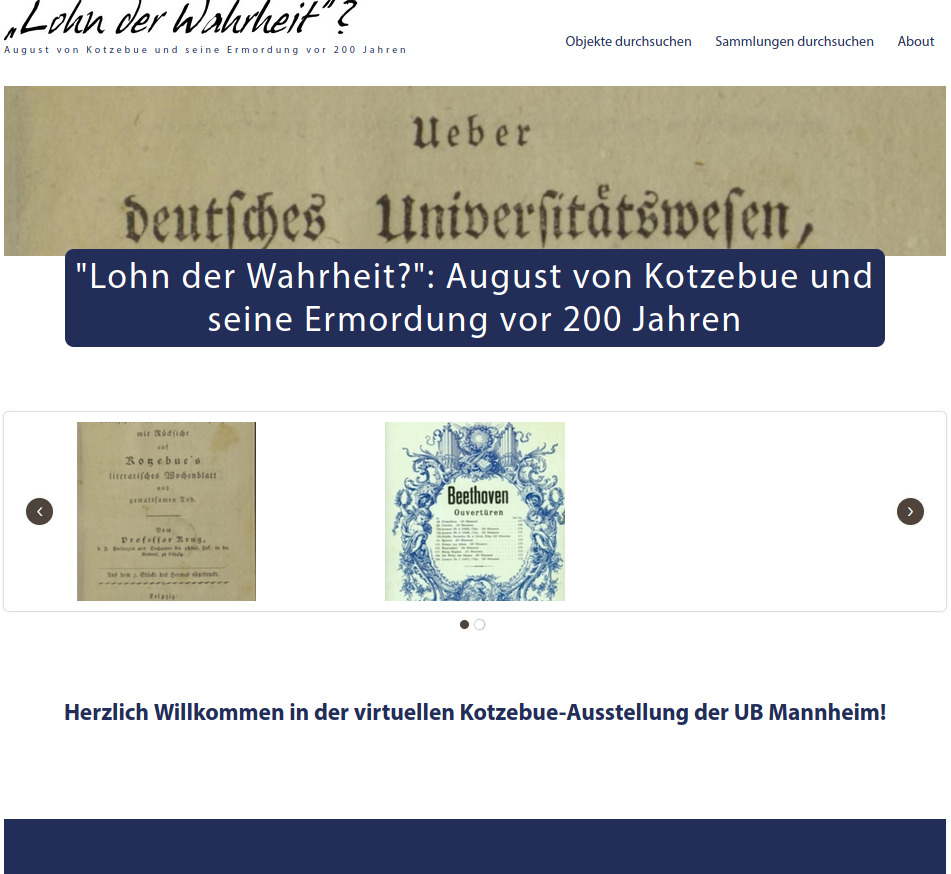

# Omeka Classic theme for MAObjects

This theme is based on the [Center Row](https://github.com/omeka/theme-centerrow) theme.

It is used by the [Mannheim University Library](https://www.bib.uni-mannheim.de) in the context of [MAObjects](https://www.bib.uni-mannheim.de/en/teaching-and-research/research-data-center-fdz/services-of-the-fdz/maobjects/) Omeka deployments to provide a theme in the corporate design of the [University of Mannheim](https://www.uni-mannheim.de/). MAObjects is a service of the Mannheim University Library that provides researchers with an Omeka-based platform to create and present digital object collections and virtual exhibitions by uploading digital objects, describing them with standardised metadata, and making the data available via an API.

<!--  -->

- **Very customizable:** Optional advanced site-wide search, ability to route or hide the quick search bar, and show/hide child pages in top navigation.
- **Customizable homepage:** Featured item/collection/exhibit, intro text, optional slideshow with autoplay and speed, optional “floating” minimal homepage layout, and toggleable breadcrumbs.
- **Item and media display controls:** Multiple user-selectable layout options. Optional Lightgallery support (including PDFs via PDF Embed), handling of non-image media, configurable media captions, options to hide headings/DC title, and show/hide citations.
- **Collection views:** Configurable collection browse page style (e.g. grid/list) and options to hide headings/duplicate title entries on collection pages.
- **Background image options:** Site-wide background image with control over position, repeat, size, and whether it appears beneath the main content area.
- _much more...!_

## Theme settings

This theme offers extensive customization options through the Omeka admin interface. The listings are grouped in the same way as in the Appearance → Configure Theme screen.

### [General][general]
These options apply to various general aspects of the theme.
|     Setting     |     Description     |
|-----------------|---------------------|
| Hide 'breadcrumbs' | Hides the breadcrumb trail (the path to the current page) from the top of content pages. |
| Disable Image Hover Effect | Disables the zoom-on-hover effect for images throughout the theme. |

### Colors
Provide a hex code to set the color of different elements of the theme. (Read more about html color codes here. Omeka only uses hex codes, formatted `#XXXXXX`.)

|     Setting     |     Description     |
|-----------------|---------------------|
| Body background color | Hex color for the main page background. |
| Border color | Hex color used for borders and separators in the theme. |
| Link color | Hex color for links (normal state). |

> [!NOTE]
> In the current state of the theme, some colors are not fully applied throughout all elements of the theme. Further improvements are planned for future versions.

### [Header and Footer][header_footer]
These options apply to the header and footer of the theme, including the quick search bar button in the header.

|     Setting     |     Description     |
|-----------------|---------------------|
| Logo File | Upload a logo image to replace the site title in the header (recommended max width ≈ 500 px). |
| Logo Text | Optional text shown together with the logo (e.g. subtitle or project name). |
| Logo Text Position | Controls whether the logo text is shown below or beside the logo. |
| Header Image | Image displayed below the header bar (e.g. banner image). |
| Header Image Height | Maximum height for the header image (CSS length value such as `300px`, `15rem`, etc.). |
| Header Image Height For Mobile Devices | Maximum height for the header image on smaller screens. |
| Header Image Position | Vertical alignment of the header image within its container (top, center or bottom). |
| Alt Text for Header Image | Alternative text for the header image to improve accessibility and screen-reader support. |
| Show Header Image On Homepage | Shows the header image on the homepage as well as on other pages. |
| Footer Text | Custom text/HTML shown in the footer of every page. |
| Display Copyright in Footer | Appends the site’s copyright information to the footer. |
| Use Advanced Site-wide Search | Enables Omeka’s advanced search form so users can search across record types and choose boolean operators. |
| Replace quick search bar with link to items/search | Routes queries from the quick search bar to the `/items/search` page instead of using the basic search. |
| Do not provide quick search bar | Completely hides the quick search bar from the header. |
| Show Top Navigation Child Pages | Shows child pages as dropdowns under the top navigation items; when unchecked, only top-level pages are shown. |

> [!NOTE]
> In the current state of the theme, some header and footer options have no effect anymore. Further improvements are planned for future versions.

### [Homepage][homepage]
These options apply to the homepage. Most of these options apply only if no other homepage is set in the Omeka settings ( Select a Homepage).

|     Setting     |     Description     |
|-----------------|---------------------|
| Display Featured Item | Shows a featured item block on the homepage. |
| Display Featured Collection | Shows a featured collection block on the homepage. |
| Display Featured Exhibit | Shows a featured exhibit block (requires the Exhibit Builder plugin). |
| Homepage Text | Introductory text/HTML displayed on the homepage. |
| Autoplay Homepage Slides | Automatically cycles through slides in the homepage carousel. |
| Slide Autoplay Speed | Time in milliseconds between slide transitions when autoplay is enabled (e.g. `5000` = 5 seconds). |
| Floating Homepage | Uses a “floating” layout where the main homepage content card appears detached from the page background. |

### [Items: Browse][items_browse]
These options apply to the items browse page (Browse All, Browse by Tag, Browse by Collection, etc.). This is the overview of all items.

|     Setting     |     Description     |
|-----------------|---------------------|
| Browse Item Page Style | Choose between **Grid** (thumbnail-focused) and **List** (metadata-focused) layout for item browse pages. |
| Hide Secondary Navigation | Hides the secondary navigation on browse pages (Browse All, Browse Collections, Browse by Tag, etc.). |
| Show list of output formats | Shows links to available output formats on item browse and item show pages. |

### [Items: Page][items_page]
These options apply to the item (show) page. This is the item detail view of one specific item.

|     Setting     |     Description     |
|-----------------|---------------------|
| Layout | Selects the item page layout: vertical (media above/below metadata) or horizontal (media and metadata side by side, with media on left or right). |
| Content Ratio | For horizontal layouts, percentage width of the primary (media) column; the metadata column uses the remaining width. |
| Show only primary media | Shows only the primary media file on the item page and hides all other attached files. |
| Non-Image Media | When enabled, non-image files that cannot be shown in the media viewer are listed as downloadable links instead of being hidden. |
| Use lightgallery | Uses the lightgallery viewer to display media; when combined with the PDF Embed plugin, PDFs can be shown in the gallery as well. |
| Hide toolbar from PDF viewer | Hides the PDF viewer toolbar when using PDF Embed with PDF.js (if supported by the browser). |
| Media Caption | Defines which metadata appears as the caption in lightgallery slides: item **Title**, **Description**, or **None**. |
| Hide heading | Hides the main heading on the item page. (To hide all element set headings globally, use the Omeka Settings screen.) |
| Hide Dublin Core Title entry | Hides the “Dublin Core: Title” element in the metadata list (useful to avoid duplicating the page heading). |
| Show citation | Displays a citation box on the item page. |

### [Collection: Browse][collections]
These options apply to the collection browse pages (overview of all collections). This is the overview of all collections.

|     Setting     |     Description     |
|-----------------|---------------------|
| Browse Collection Page Style | Choose between **Grid** and **List** layout for the collection browse page. |

### [Collection: Page][collections]
These options apply to the collection show pages (overview of one collections, showing some items). This is the collection detail view of one specific collection.

|     Setting     |     Description     |
|-----------------|---------------------|
| Show Collection Items as list | Information-only reminder that setting **Browse Item Page Style** to *List* will also show collection items in a list on collection pages. |
| Hide heading | Hides the main heading on the collection page. |
| Hide Dublin Core Title entry | Hides the “Dublin Core: Title” element in the collection metadata to avoid repeating the heading. |

### Background Image
These options allow to set a background image which is shown in the background of the theme.

|     Setting     |     Description     |
|-----------------|---------------------|
| Body Background Image | Uploads an image that is used as the global page background. |
| Body Background Image Position | Chooses how the background image is anchored when the viewport is resized (center, top, bottom, left, right). |
| Body Background Image Repeat | Controls tiling of the background image (no repeat, repeat, horizontal repeat, vertical repeat). |
| Body Background Image Size | Controls how the background image is scaled (automatic, cover the viewport, or contain within it). |
| Do not show background image under content | When enabled, the background image is not shown beneath the main content area, keeping the content background solid. |

## Installation

1. Download the theme archive from the [Omeka themes collection](https://omeka.org/classic/themes/maobjects/) or clone this repository into your Omeka installation's `themes` directory.
2. In the Omeka admin dashboard, navigate to "Appearance" and activate the "MAObjects" theme by clicking on the "Use this theme"-button.
3. Customize the theme settings as needed.

## Contributing
Contributions are welcome! Please fork the repository and submit a pull request with your changes. For major changes, please open an issue first to discuss what you would like to change.

## Copyright & Licence

MAObjects is Copyright © 2024-present Mannheim University Library, Mannheim, Germany [https://www.bib.uni-mannheim.de](https://www.bib.uni-mannheim.de).

Center Row is Copyright © 2018-present Corporation for Digital Scholarship, Vienna, Virginia, USA [http://digitalscholar.org](http://digitalscholar.org).

The Corporation for Digital Scholarship distributes the Omeka source code under the GNU General Public License, version 3 (GPLv3). See the LICENSE file for the full text.

The Omeka name is a registered trademark of the Corporation for Digital Scholarship.

Third-party copyright in this distribution is noted where applicable.

All rights not expressly granted are reserved.

[general]: docs/options-general.md
[header_footer]: docs/options-header_footer.md
[homepage]: docs/options-homepage.md
[items_page]: docs/options-items_page.md
[items_browse]: docs/options-items_browse.md
[collections]: docs/options-collections.md
