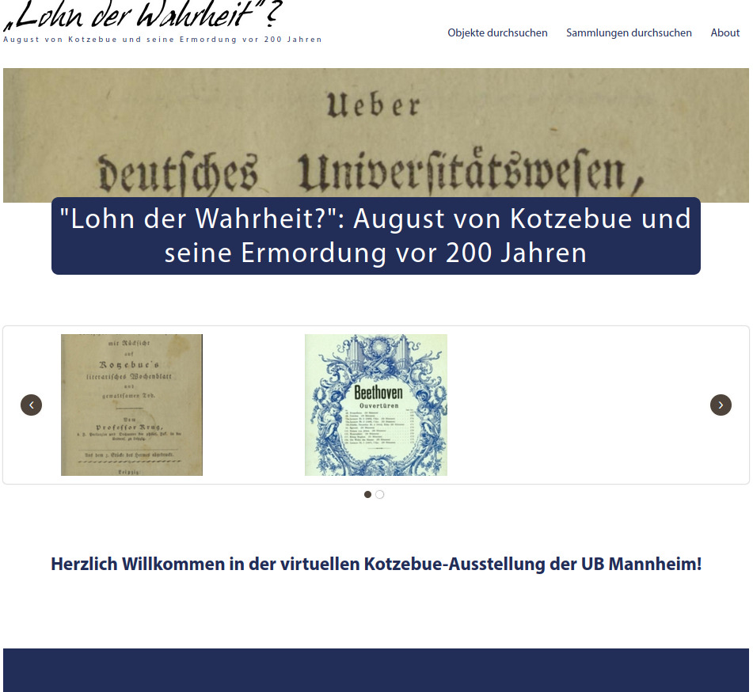

# Omeka Classic theme for MAObjects

This theme is based on the [Center Row theme](https://github.com/omeka/theme-centerrow).

It is used by the Mannheim University Library in the context of [MAObjects](https://www.bib.uni-mannheim.de/en/teaching-and-research/research-data-center-fdz/services-of-the-fdz/maobjects/) Omeka deployments.

<!--  -->

TODO:
- Describe the purpose of the theme
- List main features

## Features & Customization

This theme offers extensive customization options through the Omeka admin interface:

### Colors
|     Setting     |     Description     |
|-----------------|---------------------|
| Body background color | Background color of the main content area |
| Border color | Border color for various elements |
| Link color | Color of hyperlinks |

### Header and Footer
|     Setting     |     Description     |
|-----------------|---------------------|
| Logo File | Image file used as the site logo in the header. Replaces the standard site title text. |
| Logo Text | Additional text displayed below the logo. |
| Logo Text Position | Position of the logo text in relation to the logo (e.g. below the logo). |
| Header Image | Image file displayed below the header/navigation area. |
| Header Image Height | Maximum height of the header image on larger screens. Accepts valid CSS length units (e.g. `px`, `em`). |
| Header Image Height For Mobile Devices | Maximum height of the header image on smaller screens. Accepts valid CSS length units. |
| Header Image Position | How the header image is fixed/positioned within its container (e.g. centered). |
| Alt Text for Header Image | Alternative text describing the header image for screen readers and accessibility. |
| Show Header Image On Homepage | If enabled, the header image is also displayed on the homepage. |
| Footer Text | Custom text shown in the theme’s footer. |
| Display Copyright in Footer | If enabled, displays the site’s copyright information in the footer. |
| Use Advanced Site-wide Search | Enable Omeka’s advanced search across items, collections, and files with support for boolean search operators. |
| Replace quick search bar with link to items/search | Check this box if you wish to use items/search for queries entered in quick search bar. |
| Do not provide quick search bar | Hide the simple quick search box from the public site header. |
| Show Top Navigation Child Pages | Show child pages in the top navigation bar; when unchecked, only top-level navigation items are displayed. |

### Homepage
|     Setting     |     Description     |
|-----------------|---------------------|
| Display Featured Item | Show a featured item on the homepage. |
| Display Featured Collection | Show a featured collection on the homepage. |
| Display Featured Exhibit | Show a featured exhibit on the homepage. |
| Homepage Text | Short introductory text displayed on the homepage above the featured and recent items (no shortcodes or embedded media supported). |
| Autoplay Homepage Slides | If enabled, the homepage slideshow will automatically cycle through slides. |
| Slide Autoplay Speed | Time in milliseconds between slide transitions when autoplay is enabled. |
| Floating Homepage | Detach the main area from the edges and center it. Best suited for minimalist homepages, e.g., only a search bar. |
| Hide 'breadcrumbs'| Hide the breadcrumb navigation on the homepage. |

### Items: Page
|     Setting     |     Description     |
|-----------------|---------------------|
| Layout | Layout of the item page content area (e.g., horizontal or vertical arrangement of metadata and sidebar). |
| Non-Image Media | Check this box if you wish to display files unsupported by the media viewer as links on the page. Uncheck if you want them to remain hidden. |
| Use lightgallery | Check this box if you wish to use the lightgallery to display media files. Using this in combination with the PDF Embed plugin also shows PDF files. |
| Hide toolbar from PDF viewer | Check this box if you wish to hide the toolbar used in the PDF Viewer. This works only in combination with the PDF Embed plugin and the PDF.js option or if the browser has the same implementation. |
| Media Caption | The content of the media caption within a lightgallery slide. Choices are: Title, Description, or None. |
| Hide heading | Hide the main heading on item pages. (For hiding all headings globally, use **Settings → Show Element Set Headings**.) |
| Hide Dublin Core Title entry | Hide the Dublin Core “Title” entry on the item page (useful if the title is already shown prominently in the heading). |
| Show citation | Display a citation block on item pages. |

### Collection: Browse
|     Setting     |     Description     |
|-----------------|---------------------|
| Browse Collection Page Style | Style of the collection browse page (e.g., grid or list view). |

### Collection: Page
|     Setting     |     Description     |
|-----------------|---------------------|
| Show Collection Items as list | Info-only hint: explains that switching the global “Browse List Style” for items to `List` will also show collection items as a list. |
| Hide heading | Hide the main heading on collection show pages. |
| Hide Dublin Core Title entry | Hide the Dublin Core “Title” entry on collection show pages, where it would otherwise duplicate the collection title. |

### Background Image
|     Setting     |     Description     |
|-----------------|---------------------|
| Body Background Image | Upload an image file to use as the site-wide background behind the content area. |
| Body Background Image Position | How the background image is fixed/anchored when scaling (e.g. centered when scaling down with a fixed height). |
| Body Background Image Repeat | Controls if and how the background image is tiled (e.g. no repeat, repeat horizontally, repeat vertically). |
| Body Background Image Size | How the background image is scaled (e.g. auto/original size, cover, contain). |
| Do not show background image under content | When checked, the background image is not shown beneath the main content area (only around it). |

## Installation

1. Download the theme archive from the [Omeka themes collection](https://omeka.org/classic/themes/maobjects/) or clone this repository into your Omeka installation's `themes` directory.
2. In the Omeka admin dashboard, navigate to "Appearance" and activate the "MAObjects" theme by clicking on the "Use this theme"-button.
3. Customize the theme settings as needed.

## Contributing
Contributions are welcome! Please fork the repository and submit a pull request with your changes. For major changes, please open an issue first to discuss what you would like to change.

## Licence

The Corporation for Digital Scholarship distributes the Omeka source code under the GNU General Public License, version 3 (GPLv3). See the LICENSE file for the full text.

The Omeka name is a registered trademark of the Corporation for Digital Scholarship.

Third-party copyright in this distribution is noted where applicable.

All rights not expressly granted are reserved.