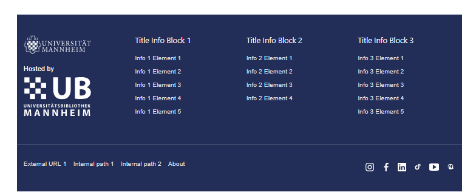

# Appearance Options

Shows some examples of appearance options that can be configured in the Omeka theme. For all options, take a look at the [themes README](../README.md) file.

## Footer

### Footer configuration
The footer is now configurable from the theme settings and follows the current MAObjects / Uni Mannheim CI-style layout:

- up to two uploaded branding logos on the left
- three configurable info blocks in the upper footer row
- optional additional footer text below the info blocks
- configurable legal links in the lower footer row
- individual social-media URL fields for the footer icons



#### Footer logo options
- `Footer Logo 1` and `Footer Logo 2` upload images for the branding column.
- `Footer Logo 1 Label` and `Footer Logo 2 Label` add optional text above the corresponding logo, for example `Hosted by`.
- `Use footer gradient background` enables a linear gradient for the footer shell. By default, the footer uses a solid Uni Mannheim blue background.

#### Footer link format
The footer block link fields and the legal-links field use the same input format:

```text
"https://www.example.com/page-a":"Example Link A"
"/imprint":"Imprint"
"/about":"About Us"
```

- Use one entry per line.
- The fields are configured as `html-input`, so line breaks stored as `<br>` are accepted as well.
- Paths starting with `/` are resolved through Omeka and therefore work correctly even when the installation lives in a subdirectory.

#### Footer optional html text
`Footer Text` renders an optional full-width HTML/text block below the three info columns. If the field is empty, no extra row or spacing is rendered.
