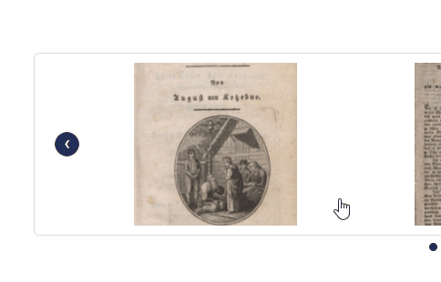

# Appearance Options

Shows some examples of appearance options that can be configured in the Omeka theme. For all options, take a look at the [themes README](../README.md) file.

## General Settings
### Example: Hide 'breadcrumbs'
Comparison example:

### Showcase: Image Hover Effect
Example of the image hover effect:

### Showcase: Submenu
Example of the submenu in the top navigation:

