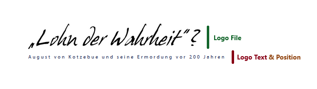

# Appearance Options

Shows some examples of appearance options that can be configured in the Omeka theme. For all options, take a look at the [themes README](../README.md) file.

## Header and Footer
### Options: Logo File, Logo Text and Logo Text Position
Example how they work together:

### Option: Header Image
TODO

### Showcase: Searchbar
Example of the searchbar in the header:

