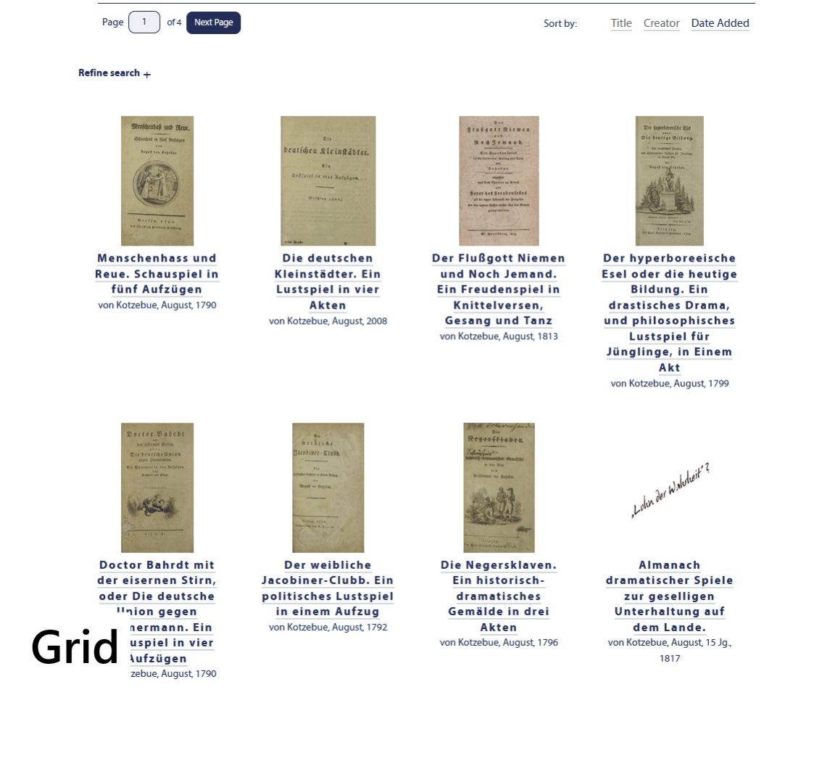
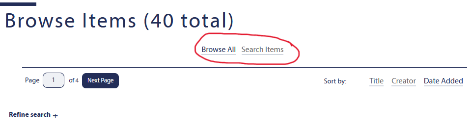

# Appearance Options

Shows some examples of appearance options that can be configured in the Omeka theme. For all options, take a look at the [themes README](../README.md) file.

## Item Browse Settings
### Option: Browse Item Page Style
Choose between **Grid** and **List** layout for the items browse page.
Comparison example:

### Option: Hide Secondary Navigation
Hides the secondary navigation on browse pages (Browse All, Browse Collections, Browse by Tag, etc.).
Example of secondary navigation:

### Option: Show List of Output Formats
Shows links to available output formats on item browse and item show pages.
Comparison example:

