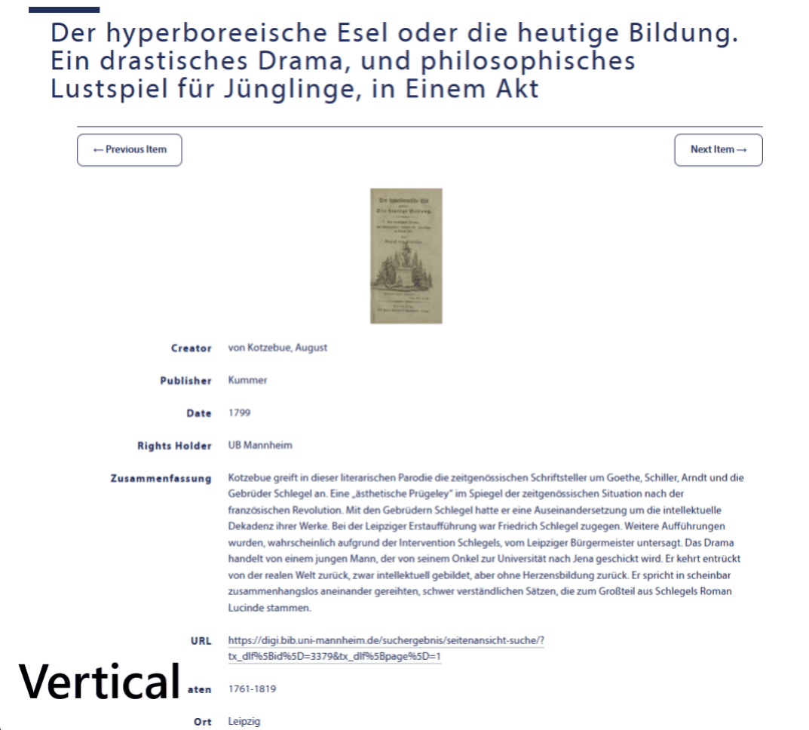
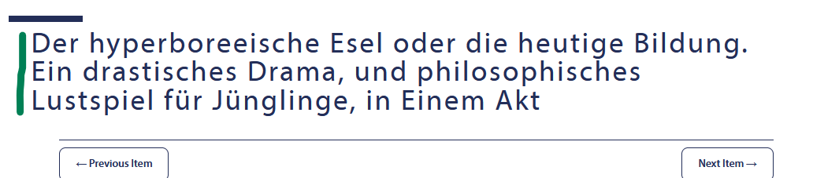
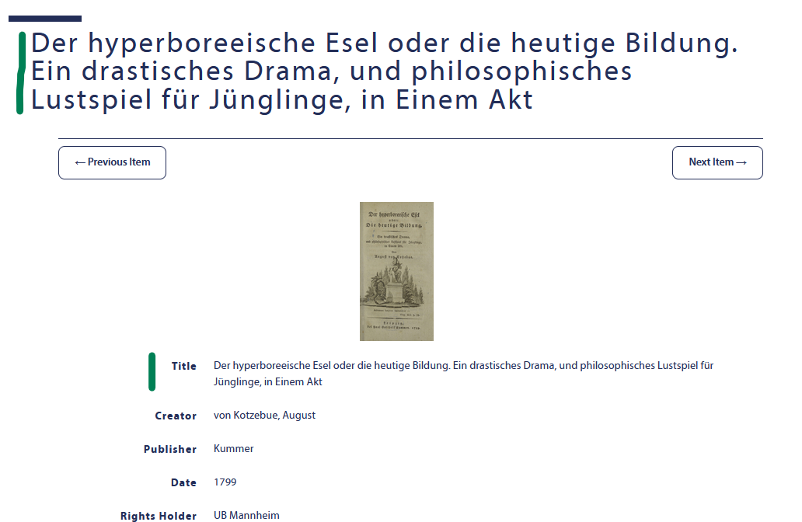

# Appearance Options

Shows some examples of appearance options that can be configured in the Omeka theme. For all options, take a look at the [themes README](../README.md) file.

## Item Page Settings
### Option: Layout
Selects the item page layout: vertical (media above/below metadata) or horizontal (media and metadata side by side, with media on left or right).

Comparison example:

### Option: Hide heading
Hides the item title heading on the item page.
Example:

### Option: Hide Dublin Core Title Entry
Hides the “Dublin Core: Title” element in the metadata list (useful to avoid duplicating the page heading).
Example:

